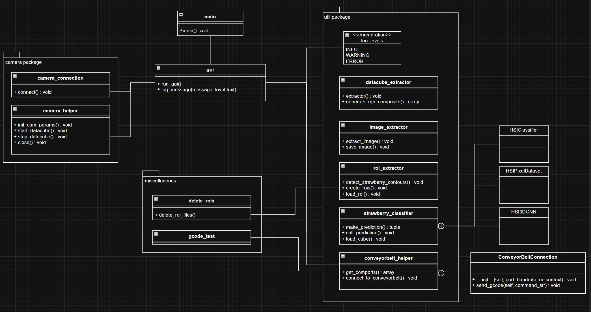
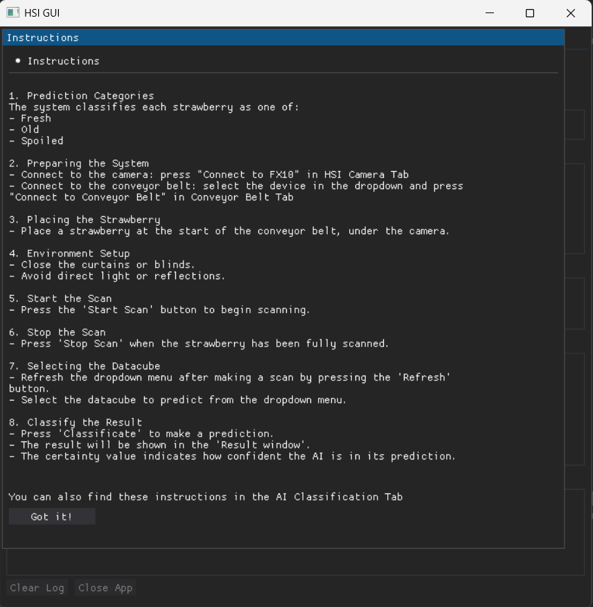
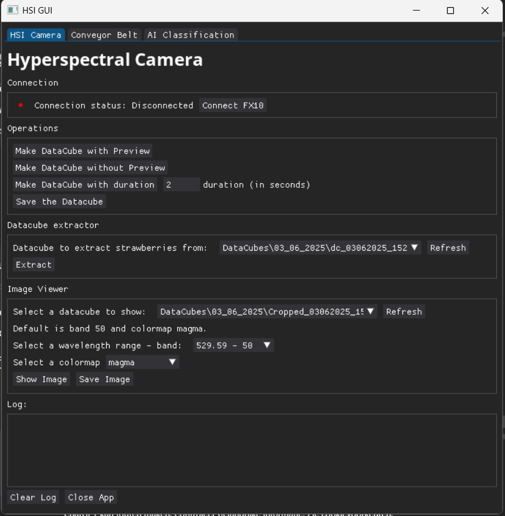
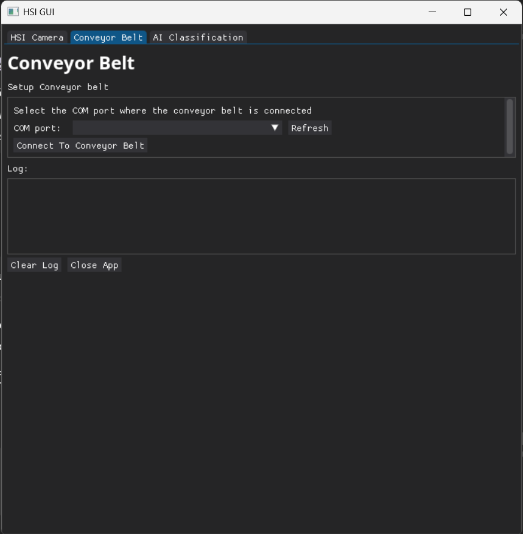
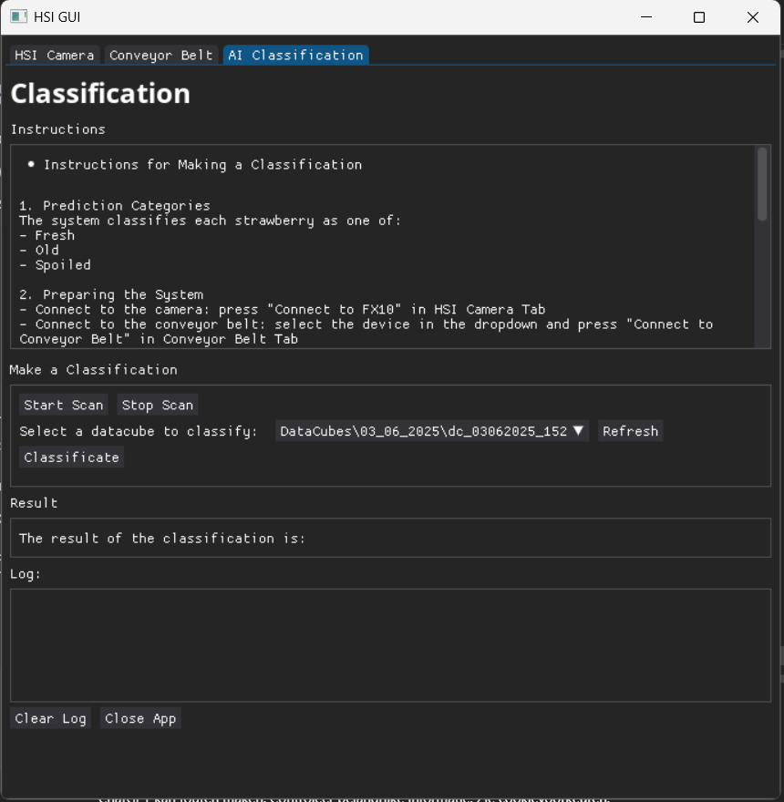

# HSI Sorting System

A hyperspectral imaging (HSI) based sorting system for strawberries. This project classifies strawberries into three categories based on their freshness: **Fresh**, **Old**, and **Spoiled**. It uses a hyperspectral camera (Specim FX10), a conveyor belt system (Desktop Conveyor - Delta X Robot), and a machine learning model to make real-time predictions through a graphical user interface.

---

## 🔧 System Components

The system is designed to work with the following physical setup:

- Specim FX10 Hyperspectral Camera
- Desktop Conveyor - Delta X Robot
- Controlled lighting (light box or dark room)
- A PC/Laptop with GPU (CUDA support recommended)
- Python 3.10 environment (used python version: 3.10.16)

---

## 🚀 Quick Start

Follow these steps to quickly get the HSI sorting system up and running:

### 1. Prerequisites
* Laptop with Windows or Linux (Tested with Ubuntu 22.04)
* Miniconda or Anaconda
* Visual Studio Code (VS Code)

### 2. Download Project and SpectralCam SDK
Download the required repositories:
* `HSI-Sortingsystem` contains the main code.
* `linear-scanner-controller` contains the SpectralCam library.

```bash
git clone [https://github.com/Hezengin/HSI-Sortingsystem.git](https://github.com/Hezengin/HSI-Sortingsystem.git)
git clone [https://gitlab.jyu.fi/jpasonen/linear-scanner-controller.git](https://gitlab.jyu.fi/jpasonen/linear-scanner-controller.git)
```

### 3. Install Miniconda

* **Windows** (via Command Prompt):
    ```powershell
    curl [https://repo.anaconda.com/miniconda/Miniconda3-latest-Windows-x86_64.exe](https://repo.anaconda.com/miniconda/Miniconda3-latest-Windows-x86_64.exe) --output %USERPROFILE%\Downloads\Miniconda3.exe
    shell "%USERPROFILE%\Downloads\Miniconda3.exe"
    ```

* **Linux** (via Terminal):
    ```bash
    wget [https://repo.anaconda.com/miniconda/Miniconda3-latest-Linux-x86_64.sh](https://repo.anaconda.com/miniconda/Miniconda3-latest-Linux-x86_64.sh)
    bash Miniconda3-latest-Linux-x86_64.sh
    ```
Then, restart the terminal to complete the installation.

### 4. Create & Activate Conda Environment
Create a new Conda environment with Python 3.10 and activate it.
```bash
conda create -n hsi_env python=3.10
conda activate hsi_env
```

### 5. SpectralCam Installation
Install the `spectralcam` library from the locally cloned `linear-scanner-controller` repository. Adjust the path below based on your system.

```bash
# Example for Windows
pip install C:\path\to\your\projects\linear-scanner-controller\spectralcam\

# Example for Linux
pip install /home/username/projects/linear-scanner-controller/spectralcam/
```

### 6. Install PyTorch
**With GPU support (CUDA 11.8):**
  ```bash
  pip install torch torchvision torchaudio --index-url [https://download.pytorch.org/whl/cu118](https://download.pytorch.org/whl/cu118)
  ```

### 7. Install Dependencies
Navigate to the `HSI-Sortingsystem` directory in your terminal and install the required packages using `pip`.
```bash
pip install -r requirements.txt
```
If any packages are missing after the installation, install them manually. For example:
```bash
pip install dearpygui psutil
```

### 8. Open Project in VS Code
1.  Open the `HSI-Sortingsystem` folder in VS Code.
2.  Press `Ctrl+Shift+P` to open the command palette.
3.  Type `Python: Select Interpreter` and select the `hsi_env` environment you created earlier.

### 9. Start the Application
Start the application from the terminal (ensure you are in the `HSI-Sortingsystem` directory and the `hsi_env` environment is active).
```bash
python main.py
```
If everything is installed correctly, the GUI will start without any issues.

## 📁 Project Structure
```bash
HSI-Sortingsystem/
├── main.py               # Entry point for the UI and logic
├── camera/               # Camera Interface
├── gui/                  # UI components
├── util/                 # Helper scripts
├── miscellaneous/        # Miscelanneous/ test files 
├── DataCubes/            # Datacube files and results
├── Resources/            # AI model, fonts
├── bands/                # Files with wavelengths and according bands. 
├── requirements.txt      # Python dependencies
├── temp_plot_clean.png   # Image Viewer
├── temp_plot_info.png    # Image Viewer
└── README.md             # Documentation
```

### Architecture

Below is a class diagram of the system.



## 🔍 Using the Classification Software
Follow these steps to scan and classify strawberries using the graphical user interface:

### 1. Prediction Categories
The system classifies each strawberry into one of:
- Fresh
- Old
- Spoiled

### 2. Preparing the System
- Go to the HSI Camera tab and press "Connect to FX10" to connect the hyperspectral camera.
- Go to the Conveyor Belt tab, select the correct device from the dropdown, and press "Connect to Conveyor Belt".

### 3. Placing the Strawberry
- Place a strawberry at the start of the conveyor belt, directly under the camera.

### 4. Environment Setup
- Close all curtains or blinds.
- Avoid direct light or strong reflections that may affect scanning quality.

### 5. Start the Scan
- Press the "Start Scan" button to begin capturing hyperspectral data.

### 6. Stop the Scan
- Press "Stop Scan" once the strawberry has passed through and been fully scanned.

### 7. Selecting the Datacube
- After scanning, press the "Refresh" button to update the dropdown list of datacubes.
- Select the relevant datacube from the dropdown.

### 8. Classify the Result
- Press "Classificate" to make a prediction.
- The predicted category will appear in the Result window.
- A certainty value will also be shown, indicating the confidence of the AI model.

## 📷 Screenshots
Below are some screenshots of the system to help you understand the user interface and functionality:

---

### 🔍 Instructions Pop up
This is the first thing you see when the app starts. It is a pop up with instructions


---

### 🔬 Hyperspectral Camera Tab
This is where you connect the HSI camera and manage datacube recording and extraction.


---

### 🚚 Conveyor Belt Tab
Connect and control the conveyor belt from this tab.


---

### 🧠 AI Classification Tab
Make predictions using trained AI to classify strawberries as Fresh, Old, or Spoiled.


## 📦 Dependencies
This project relies on several libraries for machine learning, image processing, and the UI:
- torch, torchvision, torchaudio
- opencv-python
- scikit-learn, scikit-image
- matplotlib, seaborn
- dearpygui, PyQt5
- numpy, pandas
See the full list in requirements.txt.

## 📌 Notes
- Make sure the FX10 camera driver/SDK is installed and correctly configured.
- Depending on your PC or setup, paths may need to be modified manually.
- Results may vary based on lighting conditions and camera calibration.
- This system is built for research or educational use.

## 🔗 External Documentation & Libraries
- [Conveyor X2 Documentation – Delta Robot](https://docs.deltaxrobot.com/reference/specifications/accessories/delta_x2_accessories/conveyor_x/)
- [SpectralCam Library – Linear Scanner Controller GitLab](https://gitlab.jyu.fi/jpasonen/linear-scanner-controller/-/blob/main/spectralcam/README.md)
